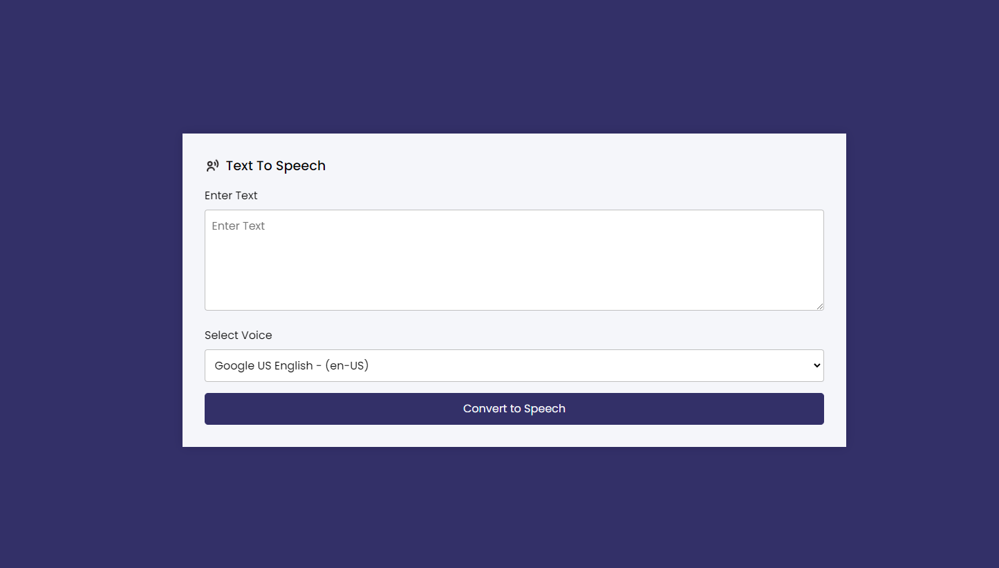

# Text To Speech Converter Application Using Vanilla JavaScript

This is simple application which one convert a text into voice speech with many variation voice artist. If you have a any idea to see in my project please feel free to create yourself & also want to contribute here please do that thanks.

# Using Technologies
- HTML5/HTML
- CSS3/CSS
- Vanilla JavaScript
- Web Speech API
- VS Code Editor
- Google Fonts (Poppins)
- Github /Git bash
- Windows Terminal
and many more....

# Features
- Get a voice version of any text
- With various voice artist
- 
-

# Live link in the about 

# Demo Preview of project

> Thanks for reach out me on github.
